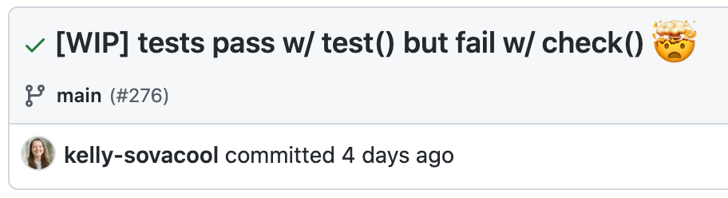

```{r setup, include=FALSE}
knitr::opts_chunk$set(echo = TRUE)
```


Unit tests for [a package I help maintain](https://github.com/SchlossLab/mikropml) 
were passing when I ran them with `devtools::test()`, but failing when I ran
them with `devtools::check()`.

{width=60%}

Eventually I found [this blog post](https://irene.rbind.io/post/two-test-env/)
which linked to 
[a StackOverflow post](https://stackoverflow.com/questions/42272119/r-cmd-check-fails-devtoolstest-works-fine) 
that had this same problem, and in their case it was caused by the base `sort()` function.
It dawned on me that I recently started using `sort()` in the branch I was working on!

When sorting character vectors, the sort order depends on the user's locale,
which is set by the environment variable `LC_COLLATE`.
`devtools::check()` and `devtools::test()` were using different values for that
environment variable, thus causing different output orders for some of the unit tests.

## Sort order depends on locale

```{r sort_default}
char_vect <- c(letters, LETTERS)

Sys.setlocale("LC_COLLATE", "en_US.UTF-8")
sorted_eng <- sort(char_vect)
sorted_eng

Sys.setlocale("LC_COLLATE", "C")
sorted_c <- sort(char_vect)
sorted_c

all(sorted_eng == sorted_c)
```


## Solutions

### 1. `sort(method="radix")`

Use base `sort()` with `method = 'radix'`, the only method where the sort 
order does not depend on the locale. 
For more details, read the `sort()` docs by running `?sort` in an R console.

```{r sort_radix}
Sys.setlocale("LC_COLLATE", "en_US.UTF-8")
sorted_eng_radix <- sort(char_vect, method = 'radix')
sorted_eng_radix

Sys.setlocale("LC_COLLATE", "C")
sorted_c_radix <- sort(char_vect, method = 'radix')
sorted_c_radix

all(sorted_eng_radix == sorted_c_radix)
```  


### 2. `stringr::str_sort()`

Use `str_sort()` from the `stringr` package. 
It has a `locale` parameter that defaults to `"eng"`, so the sort order will
be stable by default, but you can override it if you need to. 

```{r stringr}
stringr::str_sort(char_vect)
stringr::str_sort(char_vect, locale = 'haw')
```

## Wrap-up

Our package doesn't use any other functions from `stringr`, so I went with
[option 1](file:///Users/kelly/projects/personal/kelly-sovacool.github.io/_posts/2021-08-26-r-sort-locale/r-sort-locale.html#sortmethodradix) 
to avoiding adding a new dependency for only one function.
I wrote a helper function called 
[`radix_sort()`](https://github.com/SchlossLab/mikropml/blob/04adac4588fae239fdaa8b2669c431f2268dc08f/R/utils.R#L195-L212) 
that simply calls base `sort()` with radix, and 
[a test case](https://github.com/SchlossLab/mikropml/blob/04adac4588fae239fdaa8b2669c431f2268dc08f/tests/testthat/test-utils.R#L89-L99) 
to make sure it actually produces a stable sort order when the default does not.

<blockquote class="twitter-tweet"><p lang="en" dir="ltr">It&#39;s one of those debugging days... <a href="https://t.co/PQQmJXOMit">pic.twitter.com/PQQmJXOMit</a></p>&mdash; Kelly Sovacool (@kelly_sovacool) <a href="https://twitter.com/kelly_sovacool/status/1430645976830709760?ref_src=twsrc%5Etfw">August 25, 2021</a></blockquote> <script async src="https://platform.twitter.com/widgets.js" charset="utf-8"></script>

