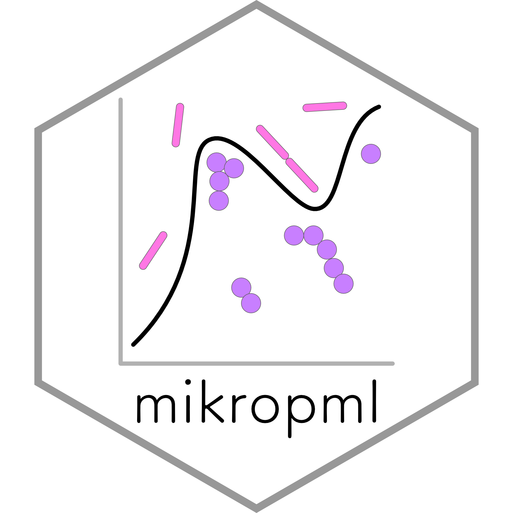

Hi, I'm Kelly! I'm a
[Bioinformatics](https://medicine.umich.edu/dept/computational-medicine-bioinformatics)
PhD candidate in [Pat Schloss' lab](http://www.schlosslab.org/) at the
University of Michigan. I develop bioinformatics tools and
data analysis pipelines for microbial ecology and host-associated microbiome research.
I'm a fan of open science, open source software, and reproducible research.
  
When I'm not in the dry lab, you might find me running, cycling, climbing, or 
otherwise being active outside. 
I also volunteer with [Girls Who Code](http://umich.edu/~girlswc/), 
teach [Software Carpentry](https://umcarpentries.github.io/) workshops, 
host [CoderSpaces office hours](https://datascience.isr.umich.edu/events/coderspaces/),
and moonlight as a [live sound engineer](https://sovacool.dev/latex-cv/sound.pdf).

---

 
 

 

 

 

 

