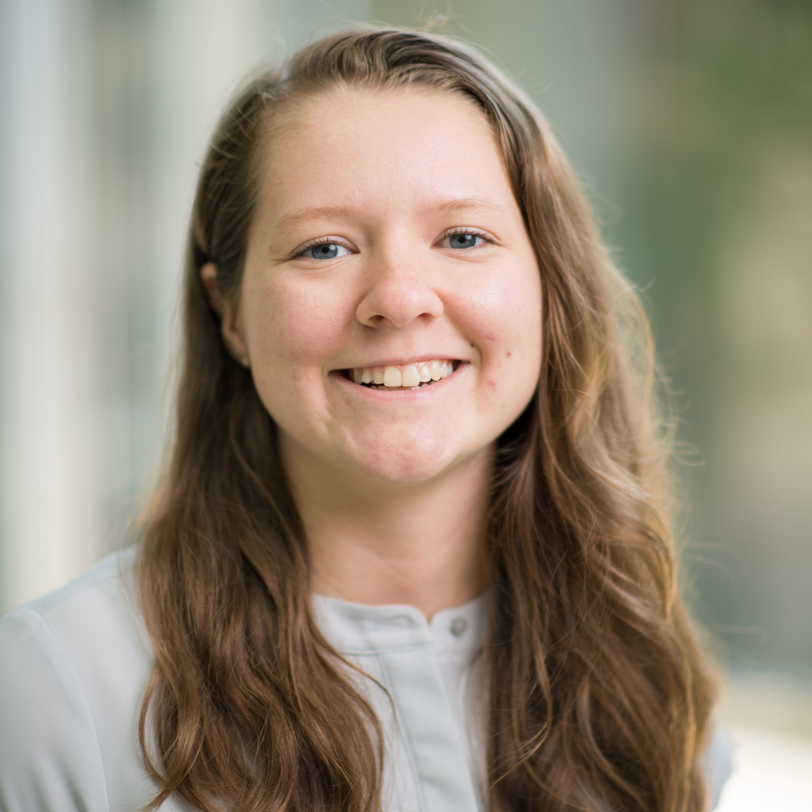

Hi, I'm Kelly! I'm a
[Bioinformatics](https://medicine.umich.edu/dept/computational-medicine-bioinformatics)
PhD candidate in [Pat Schloss' lab](http://www.schlosslab.org/) at the
University of Michigan. I’m interested in developing bioinformatics tools and
data analysis pipelines for microbial ecology.
  
When I'm not in the lab, you might find me volunteering with 
[Girls Who Code](http://umich.edu/~girlswc/), 
teaching at a [Software Carpentry](https://umswc.github.io/) workshop, 
attending a [Data Analysis Networking Group](https://um-dang.github.io) meetup, 
[running or cycling](http://bit.ly/strava-kelly), 
or moonlighting as a [live sound engineer](https://sovacool.dev/latex-cv/sound.pdf).

<aside>

</aside>

---

 

<aside>

 

 

</aside>
